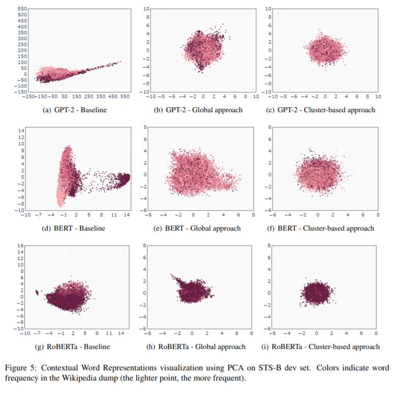

# Cluster-based Isotropy Enhancement
This is the official reposeitory for the [paper](https://aclanthology.org/2021.acl-short.73.pdf):\
_A Cluster-based Approach for Improving Isotropy in Contextual Embedding Space_



## Dataset
The dataset used in the section 5.1 related to analyzing linguistic knowledge can be found [here](https://nlp.biu.ac.il/~ravfogs/resources/syntax_distillation/).


## Citation
```
@inproceedings{rajaee-pilehvar-2021-cluster,
    title = "A Cluster-based Approach for Improving Isotropy in Contextual Embedding Space",
    author = "Rajaee, Sara  and
      Pilehvar, Mohammad Taher",
    booktitle = "Proceedings of the 59th Annual Meeting of the Association for Computational Linguistics and the 11th International Joint Conference on Natural Language Processing (Volume 2: Short Papers)",
    month = aug,
    year = "2021",
    address = "Online",
    publisher = "Association for Computational Linguistics",
    url = "https://aclanthology.org/2021.acl-short.73",
    doi = "10.18653/v1/2021.acl-short.73",
    pages = "575--584",
    abstract = "The representation degeneration problem in Contextual Word Representations (CWRs) hurts the expressiveness of the embedding space by forming an anisotropic cone where even unrelated words have excessively positive correlations. Existing techniques for tackling this issue require a learning process to re-train models with additional objectives and mostly employ a global assessment to study isotropy. Our quantitative analysis over isotropy shows that a local assessment could be more accurate due to the clustered structure of CWRs. Based on this observation, we propose a local cluster-based method to address the degeneration issue in contextual embedding spaces. We show that in clusters including punctuations and stop words, local dominant directions encode structural information, removing which can improve CWRs performance on semantic tasks. Moreover, we find that tense information in verb representations dominates sense semantics. We show that removing dominant directions of verb representations can transform the space to better suit semantic applications. Our experiments demonstrate that the proposed cluster-based method can mitigate the degeneration problem on multiple tasks.",
}
```
